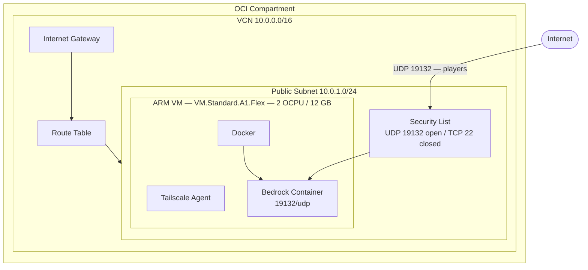

# Minecraft Bedrock ARM Server on OCI

Run a Minecraft Bedrock server on an Oracle Cloud ARM VM using Terraform, cloud-init, Docker, and Tailscale.

## Infrastructure



Terraform creates the VCN, internet gateway, route table, subnet, security list, and ARM instance. cloud-init bootstraps Docker and Tailscale on first boot.

> [!IMPORTANT]
> Terraform provisions infrastructure only.  
> It does **not** start the Bedrock container. Run `make deploy` after `make tf-apply`.

## Access Model


- **Players** connect directly to the public IP on UDP `19132`.
- **Admin / CI** join the Tailscale tailnet and connect to the VM's MagicDNS hostname over SSH (port 22 is only reachable from within the tailnet, not from the public internet).

## Quick Start

### 1) Clone your fork

```bash
git clone https://github.com/<your-username>/Minecraft_ARM_Server.git
cd Minecraft_ARM_Server
```

Optional upstream remote:

```bash
git remote add upstream https://github.com/TheTangentLine/Minecraft_ARM_Server.git
git fetch upstream
```

### 2) Install prerequisites

- OCI account with Ampere A1 availability
- Terraform
- OCI CLI
- `make`, `git`, `ssh`, `scp`

> [!WARNING]
> OCI Always Free limits can change. Confirm current limits in your tenancy before applying.

### 3) Set up OCI CLI

macOS:

```bash
brew update
brew install oci-cli
```

Linux/macOS installer:

```bash
bash -c "$(curl -L https://raw.githubusercontent.com/oracle/oci-cli/master/scripts/install/install.sh)"
```

Configure and verify:

```bash
oci setup config
oci iam region list --output table
```

> [!NOTE]
> Do not put OCI credentials in `terraform.tfvars`.  
> Terraform auth should come from OCI CLI config, environment variables, or instance principal.

### 4) Generate SSH key and initialize tfvars

```bash
make keygen
make tfvars-init
```

Fill `terraform/terraform.tfvars`:

- `compartment_id`
- `region`
- `ssh_public_key` (from `make spub`)
- `tailscale_authkey` (VM first-boot tailnet join key)
- `ubuntu_aarch64_image_id`

Get Ubuntu 22.04 ARM image OCID:

```bash
oci compute image list \
  --compartment-id <tenancy-ocid> \
  --operating-system "Canonical Ubuntu" \
  --operating-system-version "22.04" \
  --shape "VM.Standard.A1.Flex" \
  --query "data[?contains(\"display-name\", 'aarch64')].{name:\"display-name\",id:id}" \
  --output table
```

### 5) Provision infrastructure

```bash
make tf-init
make tf-plan
make tf-apply
```

### 6) Deploy Bedrock

```bash
make deploy SSH_HOST=mc-bedrock.yourtailnet.ts.net
```

> [!TIP]
> `SSH_HOST` is required for local deploy targets (`make sync-app`, `make restart-app`, `make deploy`).  
> Use your VM's Tailscale MagicDNS hostname.

Connect from Minecraft Bedrock:

- Host: `$(cd terraform && terraform output -raw public_ip)`
- Port: `19132` (UDP)

## Configure CI/CD

### CI (compose validation)

`.github/workflows/ci.yml` runs on pull requests and pushes to `main`:

```bash
docker compose -f docker-compose.yml config -q
```

If compose is invalid, CI fails.

### CD (deploy)

`.github/workflows/cd.yml` runs on pushes to `main` and:

1. Joins tailnet with `tailscale/github-action@v2`
2. Copies `docker-compose.yml` and `addons/` to `/opt/minecraft`
3. Runs `docker compose pull` and `docker compose up -d --remove-orphans`

GitHub repository secrets used by CD:

- `TAILSCALE_AUTHKEY_CI`
- `SSH_HOST_TS` (MagicDNS hostname)
- `SSH_USER` (usually `ubuntu`)
- `SSH_PRIVATE_KEY` (must match `ssh_public_key`)

> [!NOTE]
> `tailscale_authkey` in `terraform.tfvars` is for the VM.  
> `TAILSCALE_AUTHKEY_CI` in GitHub secrets is for CI runner tailnet join.

> [!NOTE]
> CD uses OpenSSH key authentication over the Tailscale network (`SSH_PRIVATE_KEY` + `SSH_HOST_TS`).  
> It does **not** use `tailscale ssh`.

## Local Operations

Run `make help` to list all commands.

Main targets:

- `make keygen`, `make spub`, `make spri`
- `make tfvars-init`
- `make tf-init`, `make tf-plan`, `make tf-apply`, `make tf-output`, `make tf-destroy`
- `make sync-app`, `make restart-app`, `make deploy`

Optional `make deploy` overrides:

- `SSH_KEY_PATH`
- `SSH_USER`
- `SSH_HOST` (if set, it overrides Terraform `public_ip` output)

## Backups

World data is in Docker volume `bedrock-data`.

Example backup:

```bash
ssh -i ~/.ssh/minecraft_oci ubuntu@<host> \
  'sudo docker run --rm -v bedrock-data:/data -v /tmp:/backup alpine tar czf /backup/bedrock-backup.tar.gz -C /data .'
scp -i ~/.ssh/minecraft_oci ubuntu@<host>:/tmp/bedrock-backup.tar.gz .
```

> [!IMPORTANT]
> Back up world data before `make tf-destroy` or `terraform destroy`.  
> Destroying the instance removes VM-local Docker volumes.

## Security Posture

- OCI security list keeps public UDP `19132` for Bedrock players.
- Public TCP `22` ingress is removed.
- Admin/automation SSH is expected over Tailscale.

> [!WARNING]
> Never commit `tailscale_authkey`, `TAILSCALE_AUTHKEY_CI`, or `SSH_PRIVATE_KEY`.

> [!IMPORTANT]
> `tailscale up --ssh` is enabled in cloud-init for optional Tailscale SSH convenience.  
> Tailscale SSH connections require SSH grants in your tailnet ACL policy.

## Troubleshooting

- **CD/SSH fails after migration**: verify VM tailnet join with `tailscale status`, confirm `SSH_HOST_TS`, confirm valid `TAILSCALE_AUTHKEY_CI`.
- **VM did not join tailnet after recreate**: ensure `tailscale_authkey` is reusable (not single-use) and still valid.
- **Tailnet join succeeds but SSH still denied**: if device approval is enabled, pre-approve/auto-approve the VM node and ensure tailnet SSH ACL grants are configured.
- **Cannot join server**: confirm UDP `19132` is open in OCI and firewall rule applied by cloud-init.
- **Container issue**: run `sudo docker compose logs -f bedrock` in `/opt/minecraft`.
- **`terraform apply` capacity error**: retry later, another availability domain, or another region.
- **World data seems reset**: ensure `docker-compose.yml` still has `bedrock-data:/data`.

## License

MIT. See `LICENSE`.
