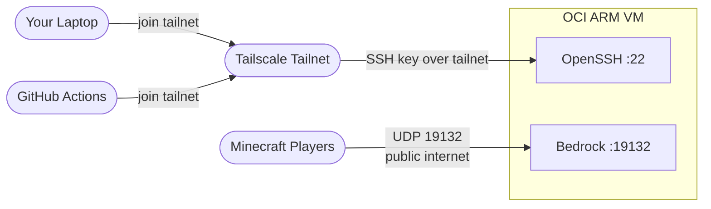

# Minecraft Bedrock ARM Server on OCI

> Run a Minecraft Bedrock server on an Oracle Cloud ARM VM — free tier, private admin access via Tailscale.


---

## Infrastructure


Terraform creates the VCN, internet gateway, route table, subnet, security list, and ARM instance. cloud-init bootstraps Docker and Tailscale on first boot.

> [!IMPORTANT]
> Terraform provisions infrastructure only.
> It does **not** start the Bedrock container. Run `make deploy` after `make tf-apply`.

---

## Access Model



- **Players** connect directly to the public IP on UDP `19132`.
- **Admin / CI** join the Tailscale tailnet and connect to the VM's MagicDNS hostname over SSH — port 22 is only reachable from within the tailnet.

---

## Quick Start

### Step 0 — Prerequisites

Before you begin, make sure you have:

- An OCI account with [Always Free Ampere A1](https://www.oracle.com/cloud/free/) eligibility
- [Terraform](https://developer.hashicorp.com/terraform/install)
- [OCI CLI](https://docs.oracle.com/en-us/iaas/Content/API/SDKDocs/cliinstall.htm)
- [Tailscale](https://tailscale.com/download) account and client
- `make`, `git`, `ssh`, `scp` (standard on macOS/Linux)

> [!WARNING]
> OCI Always Free limits can change. Confirm current limits in your tenancy console before applying.

---

### Step 1 — Set up Tailscale

1. [Sign up for Tailscale](https://tailscale.com/) (free for personal use).
2. In the [Tailscale admin console](https://login.tailscale.com/admin/settings/keys), generate **two** auth keys:

| Key | Purpose | Where it goes |
| --- | ------- | ------------- |
| VM key (reusable) | First-boot VM join | `tailscale_authkey` in `terraform.tfvars` |
| CI key (ephemeral) | GitHub Actions runner join | `TAILSCALE_AUTHKEY_CI` GitHub secret |

> [!NOTE]
> Use a **reusable** key for the VM. A single-use key will fail if you ever recreate the instance with `terraform destroy` + `terraform apply`.
>
> If your tailnet enforces device approval, ensure the VM node is auto-approved or pre-approved.

---

### Step 2 — Set up OCI CLI

macOS:

```bash
brew update && brew install oci-cli
```

Linux / macOS (official installer):

```bash
bash -c "$(curl -L https://raw.githubusercontent.com/oracle/oci-cli/master/scripts/install/install.sh)"
```

Configure and verify:

```bash
oci setup config
oci iam region list --output table
```

> [!NOTE]
> Do not put OCI credentials in `terraform.tfvars`.
> Terraform reads auth from OCI CLI config (`~/.oci/config`), environment variables, or instance principal.

---

### Step 3 — Fork and clone

1. Click **Fork** on GitHub to create your own copy.
2. Clone your fork:

```bash
git clone https://github.com/<your-username>/Minecraft_ARM_Server.git
cd Minecraft_ARM_Server
```

Optional — track the original repo for updates:

```bash
git remote add upstream https://github.com/TheTangentLine/Minecraft_ARM_Server.git
git fetch upstream
```

---

### Step 4 — Configure secrets and tfvars

**Generate SSH key and init tfvars:**

```bash
make keygen        # generates ~/.ssh/minecraft_oci
make tfvars-init   # copies terraform.tfvars.example -> terraform.tfvars
```

**Fill `terraform/terraform.tfvars`:**

| Variable | Value |
| -------- | ----- |
| `compartment_id` | OCI Console → Identity → Compartments |
| `region` | e.g. `ap-singapore-1` |
| `ssh_public_key` | from `make spub` |
| `tailscale_authkey` | VM reusable key from Step 1 |
| `ubuntu_aarch64_image_id` | lookup below |

Look up Ubuntu 22.04 ARM image OCID:

```bash
oci compute image list \
  --compartment-id <tenancy-ocid> \
  --operating-system "Canonical Ubuntu" \
  --operating-system-version "22.04" \
  --shape "VM.Standard.A1.Flex" \
  --query "data[?contains(\"display-name\", 'aarch64')].{name:\"display-name\",id:id}" \
  --output table
```

**Add GitHub repository secrets** (for CD to work):

| Secret | Value |
| ------ | ----- |
| `TAILSCALE_AUTHKEY_CI` | CI ephemeral key from Step 1 |
| `SSH_HOST_TS` | VM MagicDNS hostname (e.g. `mc-bedrock.yourtailnet.ts.net`) |
| `SSH_USER` | `ubuntu` |
| `SSH_PRIVATE_KEY` | contents of `~/.ssh/minecraft_oci` (from `make spri`) |

> [!NOTE]
> `SSH_HOST_TS` is the MagicDNS name, available in Tailscale admin after the VM first boots and joins the tailnet. You can set it after Step 5.

---

### Step 5 — Provision infrastructure

```bash
make tf-init
make tf-plan
make tf-apply
```

After apply completes, the VM is running and Tailscale joins on first boot (via cloud-init). Note the `public_ip` output for Step 6.

---

### Step 6 — Deploy Bedrock

```bash
make deploy SSH_HOST=mc-bedrock.yourtailnet.ts.net
```

> [!TIP]
> `SSH_HOST` is required for all local deploy targets. Use your VM's Tailscale MagicDNS hostname.

Connect from Minecraft Bedrock:

- **Host**: `terraform output -raw public_ip`
- **Port**: `19132` (UDP)

---

## CI/CD

### CI — compose validation

`.github/workflows/ci.yml` runs on pull requests and pushes to `main`:

```bash
docker compose -f docker-compose.yml config -q
```

Fails if `docker-compose.yml` is invalid.

### CD — deploy

`.github/workflows/cd.yml` runs on push to `main`:

1. Joins tailnet via `tailscale/github-action@v2` using `TAILSCALE_AUTHKEY_CI`
2. Copies `docker-compose.yml` and `addons/` to `/opt/minecraft` via SCP
3. Runs `docker compose pull` + `docker compose up -d --remove-orphans`

> [!NOTE]
> CD uses OpenSSH key authentication over the Tailscale network.
> It does **not** use `tailscale ssh`.

---

## Local Operations

```bash
make help
```

| Command | Description |
| ------- | ----------- |
| `make keygen` | Generate SSH key pair at `~/.ssh/minecraft_oci` |
| `make spub` | Print public key |
| `make spri` | Print private key |
| `make tfvars-init` | Copy `terraform.tfvars.example` → `terraform.tfvars` |
| `make tf-init` / `tf-plan` / `tf-apply` | Terraform lifecycle |
| `make tf-output` | Show Terraform outputs |
| `make tf-destroy` | Destroy all OCI infrastructure |
| `make sync-app` | Copy compose + addons to VM |
| `make restart-app` | Pull image and restart container |
| `make deploy` | `sync-app` + `restart-app` |

Optional overrides for deploy targets:

```bash
make deploy SSH_HOST=<magicdns> SSH_USER=ubuntu SSH_KEY_PATH=~/.ssh/minecraft_oci
```

---

## Backups

World data lives in Docker volume `bedrock-data` on the VM.

```bash
ssh -i ~/.ssh/minecraft_oci ubuntu@<host> \
  'sudo docker run --rm -v bedrock-data:/data -v /tmp:/backup alpine tar czf /backup/bedrock-backup.tar.gz -C /data .'
scp -i ~/.ssh/minecraft_oci ubuntu@<host>:/tmp/bedrock-backup.tar.gz .
```

> [!IMPORTANT]
> Back up world data **before** `make tf-destroy`. Destroying the instance removes VM-local Docker volumes.

---

## Security Posture

- OCI security list keeps public UDP `19132` open for Bedrock players.
- Public TCP `22` ingress is removed — SSH is only reachable over Tailscale.
- Admin and CI automation connect via tailnet SSH with key auth.

> [!WARNING]
> Never commit `tailscale_authkey`, `TAILSCALE_AUTHKEY_CI`, or `SSH_PRIVATE_KEY`.

> [!IMPORTANT]
> `tailscale up --ssh` is enabled in cloud-init for optional Tailscale SSH convenience.
> Tailscale SSH connections require SSH grants in your tailnet ACL policy.

---

## Troubleshooting

- **CD/SSH fails**: verify VM joined tailnet (`tailscale status`), confirm `SSH_HOST_TS` and valid `TAILSCALE_AUTHKEY_CI`.
- **VM did not join tailnet after recreate**: ensure `tailscale_authkey` is reusable, not single-use.
- **Tailnet join OK but SSH denied**: check device approval and tailnet SSH ACL grants.
- **Cannot join server**: confirm UDP `19132` is open in OCI security list and iptables rule applied by cloud-init.
- **Container issue**: `sudo docker compose logs -f bedrock` in `/opt/minecraft`.
- **`terraform apply` capacity error**: retry later, try a different availability domain or region.
- **World data reset**: ensure `docker-compose.yml` still mounts `bedrock-data:/data`.

---

## License

MIT. See [`LICENSE`](LICENSE).
